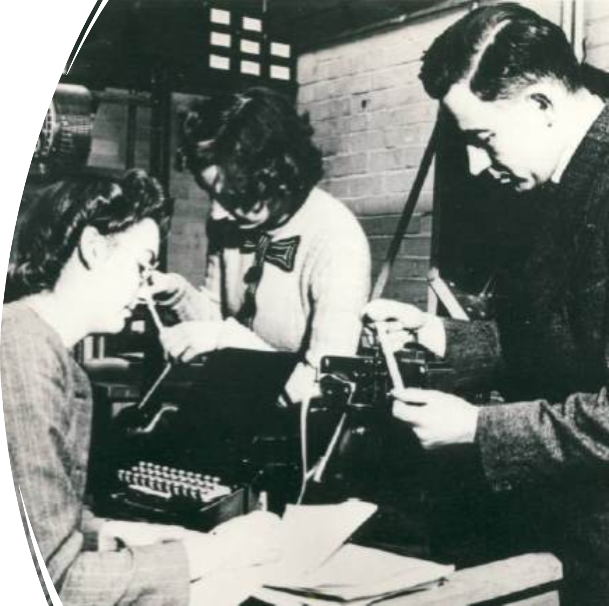

# Programming Language Design

## Module 1: Introduction to Programming Languages

<br>
<br>

Slides © Grant Williams, [CC BY-SA 4.0](https://creativecommons.org/licenses/by-sa/4.0/).  

<br>

This is an open educational resource.
Feel free to submit fixes, improvements, and new material [here](https://github.com/grantwill74/notes-on-programming-language-design).

---

# What is this class?

This class is about programming languages

Those things we use to write computer programs. 

Specifically, it's about:
- Programming paradigms: the different ways that programming languages see the world.
- Language design: how to actually design and implement a programming language from scratch 
- Functional programming: the programming paradigm that is very popular now in the industry, but which many of you have not ever used before. 
- Haskell: the specific functional programming language we will be learning

---

# About me

I am a teaching professor here

I used to work at Microsoft as a data scientist and software engineer.

Before that, most of my research focused on automated requirements engineering.

However, I have published a workshop paper in which I created a programming language ([Copper](https://scholar.google.com/citations?view_op=view_citation&hl=en&user=uifpy9gAAAAJ&citation_for_view=uifpy9gAAAAJ:LkGwnXOMwfcC)). Programming languages have always been of interest to me. 

---

# What's interesting about programming languages?

At this point, you've learned a few languages:
- You've had computer org, so some assembly experience. Maybe C and assembly, so some C.
- You may have had systems programming: more C.
- Some of you had CS 220, which teaches Typescript.
- Those of you who started here: Python was the language of CS 122.
- You may have also learned Java for algorithms and data structures. 
- Transfer students may have had C++ at clark.

So that's like 5, right off the bat.

---

# Those languages

Now that you've had the experience of learning a bunch of languages, you're probably starting to realize that learning a new language is kind of...I don't want to say "automatic", but...

Like, you know what questions to ask:
- How do I make a variable?
- How do I make a class/struct?
- How do I make a function?
- How do i do a loop?

---

# Those languages (2)

The reason for this isn't that all of computing can be reduced to those concepts, and that all languages are basically the same.

The reason is actually that all the languages you've learned have been imperative paradigm languages, with varying degrees of object-orientation.

They've all been the same *kind* of language. There are radically different ways that programming can work. And as someone who uses them reasonably often, IMO they're just as good.

But before we go too deep, let's talk about how class is going to work...

---

# Questions?

<!-- _class: invert questions -->

---

# The structure of this class

This is a learning mastery class. That means there will be several things that you need to demonstrate (mastery elements) to pass.

Each one is worth a chunk of your final grade.

However, even though they will all be tested in in-class quizzes, I will give you two retakes for each one.

Therefore, there will be 3 opportunities to demonstrate each mastery element. 

I will take the maximum score of all of these to determine what you make on the mastery element.

---

# The quizzes

Each mastery element will have one quiz focused on that element.

There will be six quizzes in total, and each will be roughly 10 minutes long.

If you get a 100% on all the quizzes, congratulations, you don't need to show up at the midterms or the final.

---

# The "exams"

There will be a "midterm" and an "endterm" exam.

Each one will just be three mastery problems stapled together. 

It's not really an exam, it's just a retest opportunity. There will be 3 new problems.

There's a final too. It's going to have problems for all six mastery elements stapled together.

---

# The retakes

If you get a 100% on mastery element 1, a 0% on mastery element 2, and a 50% on mastery element 3, you will want to take the midterm.

When you do, you can skip problem 1. It's just going to be a re-take opportunity for ME 1, which you have already gotten a 100% on so you can't improve. 

However, it will be an opportunity to improve on ME 2 and 3.

If you still need an opportunity, you can take the final. It will have all six.

---

# Skipping tests

If you're happy with your grade, you can skip the final. Therefore, the exams and final are optional. They are just retake options that are made universally available.

You can also skip the quizzes and take the midterm, or even skip everything except the final.

The latter is a bad idea: if you miss everything, I can't give you an incomplete grade for the class, because you haven't attempted 70% of it. You would fail unless you could obtain a withdrawal (or medical withdrawal)


---

# Mastery areas: before midterm

1. Demonstrate an understanding of programming paradigms, and the special role that lambda calculus plays as the foundation of functional programming. Demonstrate a basic understanding of lambda calculus, including anonymous functions, partial application, and curried definitions.
2. Demonstrate a basic level of competence with Haskell. E.g., define types, use functions, write some non-trivial functions.
3. Demonstrate an understanding of functional operators such as map, filter, and fold.

---

# Mastery areas: before second term

4. Demonstrate an understanding of type-classes, especially Functor and Applicative.
5. Demonstrate an understanding of logic programming.
6. Demonstrate an understanding of the dreaded monad, especially the bind operation (either implementing, using, or both).

---

# The Book

We will mainly be using [The Haskell Wikibook](https://en.wikibooks.org/wiki/Haskell).

It's an open educational resource, and it's excellent. Easily as good as a regular pay book.

Whenever I assign readings, be sure to *do all the exercises*.

Another good one is [Learn You a Haskell for Great Good](https://learnyouahaskell.github.io/). [There's a free online version](https://learnyouahaskell.github.io/chapters.html). This used to be the main textbook, but the main issue was that the harder chapters didn't have any unworked practice problems, only problems that were worked inline.

Still highly recommended, and also free.

---

# Let's look at the rest of the syllabus

---

# Questions?

<!-- _class: invert questions -->

---

# Languages

What is a language?

According to Wikipedia: “a structured system of communication”

I like this definition. If a communication system doesn’t have structure, it’s hard to call it a language 

Structure here means grammar: a set of rules for building complex thoughts out of groups simple ones. 

Crows communicate by caw-ing, but I haven’t heard evidence that crow communication supports nested sub-clauses or grammar.

---

# Languages (2)

Nested sub-clauses? That's what makes human languages rich. 

Humans can nest clauses inside of clauses: “I thought that he liked that he wasn’t having to work nights.”

“I thought that ( he liked that ( he wasn’t having to work nights. ) )”

---

# Human languages

In academia, we put languages into 2 categories: human and formal.

A human language is spoken by humans. There are two sub-categories of human language:
1. Natural: the language evolved over time
2. Constructed: someone invented the language intentionally 

Most human languages are natural languages.

However, there are some human languages that are not natural. They are called “constructed languages” or “conlangs” for short. [Can anyone name some?]

---

# Formal languages

In contrast to human languages, formal languages are created by specifying precise grammar rules with no room for ambiguity. 

With formal languages, we can say that a phrase is “valid” or “invalid”.

There’s no “mostly understandable but confusing” like with human languages. 

Instead, we follow rules precisely. 

---

# Example of rules

[This](https://cs.wmich.edu/~gupta/teaching/cs4850/sumII06/The%20syntax%20of%20C%20in%20Backus-Naur%20form.htm) is an exhaustive syntax of the C programming language.

It contains all the information needed to determine whether a given string of letters is a valid C program or not. 

This is called “syntax”

Note: it does not tell you how to execute that language or what it means (that’s called “semantics”), only whether it’s a C program. 

We’ll talk more about how to read this grammar later in the course, but notice how much smaller it is than a book on English grammar. 

---

# Human Languages

- Natural
    - English
    - Japanese
    - Albanian
    - Cherokee
    - ... like 7,000 more ...
- Constructed
    - Esperanto
    - Toki pona
    - Elvish
    - ...

---

# Formal Languages

- Mathematical expressions
- Predicate/first-order/second-order logic
- C
- [Malbolge](https://en.wikipedia.org/wiki/Malbolge) (any other *esoteric* languages?)
- Python
- Ruby
- Scratch (yes, visual languages can be formal)
- UML
- The event scripting language for RPG Maker games.

---

# History of programming languages

This is strange to think about, but programming is older than programming languages

Programmers still had to use language to describe their programs, but the language they used was not specifically for programming. 

Many of them used mathematical formalisms instead.

---

# Example: Ada Lovelace

The first computer programmer was Ada Lovelace (Augusta Ada King)

She wrote the first computer program ["Note G"](https://en.wikipedia.org/wiki/File:Diagram_for_the_computation_of_Bernoulli_numbers.jpg), which explained how to generate the Bernoulli numbers on Babbage’s analytical engine.

Notice that it’s just a table. Each operation is on one row. Each operation is identified by its mathematical operation, the variables it acts upon, and the variable results

It’s like assembly language but using mathematical notation. Notice that some steps are bracketed: these can be repeated

---

# The first programming language: Plankalkül

The first formal language specifically made for writing programs is probably Plankalkül

Developed in the mid 1940’s by Konrad Zuse, the first person (known) to have built a working mechanical computer.

He was working for the bad guys during WW2: he was funded by the German government to develop computers (one was used to develop the guidance mechanism of the Hs 293 and 294 radio guided missiles). 

His prototype computers got blown up by Allied bombers several times. 

However, his programming language, developed for his computers, survived as an influence on ALGOL (another influential programming language).

---

# It was weird

Plankalkül had several unique features:
- Only one primitive datatype: the bit
- Bits could be grouped together into sequences or records for complex types
- It used two-dimensional notation
- Invented the assignment operator (he used → for it)

[Here are some examples.](https://wtf.hijacked.us/wiki/index.php/Plankalk%C3%BCl)

---

# It was weird (2)

By our standards, Plankalkül seems strange. 

Especially the 2D notation. But recall: Lovelace's program was also tabular.

However, it was revolutionary for introducing the concept of a specialized formal language for describing computer programs. 

Plankalkül was not implemented by Zuse. It wasn’t actually implemented until decades later by hobbyists. 

---

# High level languages

Plankalkül was a “high level” programming language.

High level means that you don’t need to know all the details of the computer to write code in it. Instead, you use a standardized set of operations that the programming language specifies. 

Someone may then implement a system that allows that high level code to run on an actual machine. (that system can be a compiler or interpreter for example, or even an algorithm for hand-compiling the program)

[do we know about compilers and interpreters?]

---

# Low level languages

Oddly, the first low-level language actually came out after the first high-level language.

It was the assembly language for the automatic relay computer (ARC), developed by Andrew Booth and his assistants Kathleen Britten, and Xenia Sweeting (pictured right)


---

# Example Arc code


---


# Compilers, assemblers, interpretors

Assemblers take a list of instructions (often, assembly programs are called “listings” instead) and turn each one into machine code. 

A compiler is a tool that turns code written for one language into another language (often assembly, but many compilers output to C or to a virtual language instead).

Sometimes people call it a "transpiler" if it translates from one high-level language to another. (e.g., Typescript refers to its compilation process in Javascript as "transpiling").

Compilers are harder to write than assemblers: it wasn’t until the early 1950s that we started to see the first compiled languages. 

---

# Questions?

<!-- _class: invert questions -->

---

# High level vs. low level

Assembly language has a 1-to-1 or almost 1-to-1 correspondence between an operation in the language and an operation performed by the computer. 

For example, if I write the x86 assembly instruction: “add eax, ecx”, that assembles to 1 machine opcode (which adds the ecx and eax registers together writing the sum to eax)

On the other hand, if I write in C: “x = x + y”, this could actually result in multiple instructions being generated (depending on whether the variables are in registers).

For example: 
```
mov eax, [x]
add eax, [y]
mov [x], eax
```

---

# Blurring the lines

Of course, that 1-to-1 definition is not hard and fast

Some assemblers support “macros”, which are custom instructions that can generate multiple instructions

For example, many assemblers support a “times” macro that performs an operation a certain number of times. This is not an instruction that the machine supports.

Therefore, it’s hard to really make a hard dividing line between high and low-level languages. I've even seen people use the term "high level assembly" for some assemblers, like [this one](https://www.randallhyde.com/AssemblyLanguage/www.artofasm.com/index.html).

---

# The language continuum 

Instead of a hard boundary between high-level and low-level languages, we often think of a continuum.

At the far left end are the lowest level languages: machine languages for different computers.

A little to the right are assembly languages. Then macro assemblers. 

Then to the right of that are the simplest high-level programming languages. Plankalkül probably goes here.

As we go further to the right, we get more and more expressive features, and we have to write less and less code, but the result is “farther away” from the machine and therefore less predictable in how it will be implemented and how fast it will be. 

---

# Fallacies

The language continuum is not fast and hard vs. slow and easy.

Sometimes, a low-level language can have a feature that a high-level language doesn't. For example, an assembly language with a true 'mod' instruction would make it easier to compute a possibly negatively indexed modulus than doing it in C.

Sometimes, a low-level language can be *slower* than a high-level language. If you are doing a ton of string comparisons for equality, a language with automatic string-interning, like Java or Python, will be faster.

---

# Control over hardware

The main distinction between low and high level languages is about how much control/interaction the language gives over hardware.

For example, a low level language lets you express exactly *how* a string comparison is done. Whether by byte-matching (raw comparison) or identity (interned comparison).

A low level language lets you choose *where* a value lives. In a register, on the stack, etc. 

Normally the distinction makes only a small difference, but sometimes it matters. We need both low and high level languages.

---

# Questions?

<!-- _class: questions invert -->

---

# Languages in time: the 50s

When high-level programming languages were new, they weren’t actually very high level.

To our modern eyes, many of these languages look like they might as well be assembly. However, they often contained many helpful convenience features for common tasks.

Example: input/output. In assembly, it often involves writing special values to memory-mapped addresses or hardware ports.

Early high-level languages in the 50’s typically had some “print” or “read” equivalents that were cross platform and much easier. 

---

# FORTRAN

The first commercially successful programming language is called [FORTRAN](https://en.wikipedia.org/wiki/Fortran). Developed by John Backus at IBM. 

It stands for “FORmula TRANslating system”.

The idea was to let scientists write down formulas and run them instead of needing to translate them to assembly code. 

For example: x = 20 * y + z + w is more natural than:
```
mov eax, [y]
mul 20
add eax, [z]
add eax, [w]
mov [x], eax
```

---

# FORTRAN (2)

As you might expect from a programming language introduced in the 50s, it’s very, very simple. 
There were no loops. There were no functions.

The “if” statement always had 3 branches: one for if the result of an expression was negative, one for zero, and one for positive. 

So “if x < 20: do something” was actually written:
```
IF( X – 20 ) 20, 30, 30
20 do something
30 … program continues … 
```

Bizarre feature: you could give the Monte Carlo frequency of one of the branches so the compiler could give the most likely branches the best memory locations. 

---

# Fun notes about FORTRAN

It was referred to as “old-fashioned” in a 1968 journal article*.

…yet, it is still widely used in the scientific/supercomputer community 

It has a lot more features now than it used to. People aren’t still using the weird 3-branch if statement anymore. 

It’s an extremely fast language. FORTRAN compilers used to regularly beat C compilers. It’s not so true today, but if you look at the fastest C programs on [this site](https://benchmarksgame-team.pages.debian.net/benchmarksgame/fastest/gcc-ifx.html), most of them are basically assembly anyway:

(FORTRAN ties C in pi-digits computation)

<div class="footnote">

*Kemeny, John G.; Kurtz, Thomas E. (11 October 1968). "Dartmouth Time-Sharing". Science. 162 (3850): 223–228. Bibcode:1968Sci...162..223K. doi:10.1126/science.162.3850.223. PMID 5675464

</div>

---

# FLOW-MATIC

Designed by Rear Admiral lower-half Grace Hopper

One of her goals was to make a compiler for a language that seemed as “English-like” as possible.

The idea was to make it easy for business logic to be programmed (requiring less formal language expertise). 

She developed a language called B-0 (business language 0), later renamed FLOW-MATIC 

---

# Example code

```flowmatic
 (0)  INPUT INVENTORY FILE-A PRICE FILE-B ; OUTPUT PRICED-INV FILE-C UNPRICED-INV
     FILE-D ; HSP D .
 (1)  COMPARE PRODUCT-NO (A) WITH PRODUCT-NO (B) ; IF GREATER GO TO OPERATION 10 ;
     IF EQUAL GO TO OPERATION 5 ; OTHERWISE GO TO OPERATION 2 .
 (2)  TRANSFER A TO D .
 (3)  WRITE-ITEM D .
 (4)  JUMP TO OPERATION 8 .
 (5)  TRANSFER A TO C .
 (6)  MOVE UNIT-PRICE (B) TO UNIT-PRICE (C) .
 (7)  WRITE-ITEM C .
 (8)  READ-ITEM A ; IF END OF DATA GO TO OPERATION 14 .
 (9)  JUMP TO OPERATION 1 .
(10)  READ-ITEM B ; IF END OF DATA GO TO OPERATION 12 .
(11)  JUMP TO OPERATION 1 .
(12)  SET OPERATION 9 TO GO TO OPERATION 2 .
(13)  JUMP TO OPERATION 2 .
(14)  TEST PRODUCT-NO (B) AGAINST ; IF EQUAL GO TO OPERATION 16 ;
     OTHERWISE GO TO OPERATION 15 .
(15)  REWIND B .
(16)  CLOSE-OUT FILES C ; D .
(17)  STOP . (END)
```

---

# FLOW-MATIC to COBOL

The idea behind FLOW-MATIC was accessibility 

It was a language focused on the needs of the business community; it was intended to be used by people who weren’t computer scientists.

It was noticed by computer scientist Mary K. Hawes at Burroughs Corporation (an IBM competitor) who wanted to create a common business programming language. 

---

# FLOW-MATIC to COBOL (2)

Mary Hawes invited Grace Hopper to work on the spec. Grace Hopper suggested petitioning the department of defense for funding. 

They did so, and the resulting committee created COBOL. 

According to Hopper, COBOL was 95% FLOW-MATIC. 

---

# Flow-charts

Notice that the code reads more like a process than we’re used to.

There’s isn’t a lot of hierarchical organization (if any).

Instead there’s a lot of “jump to operation X”.

This is true of both FORTRAN and COBOL. 

The developer workflow as very different in those days. People would often start programming by writing a flow-chart. 

The flow-chart would then be converted to code. Each line was a goto. Each split was a branch. 

---

# Flow-charts (2)

Interestingly, this made it fairly easy to write even assembly too. Starting with a flowchart is straightforward.

The problem is going backwards. It’s tedious to edit the program to change the control flow. 

The solution to this was “structured programming”. We’ll talk about it soon. 

---

# Punchcards 

Quick note: both FORTRAN and COBOL are associated with punchcards

You might be imagining someone punching holes in them manually.

In actuality they were just a way of storing text.

You would type your program on a terminal, hit the print button, and the punchcards would be printed out.

You would hand that stack to an operator.

Don’t drop it! 

---

# Questions?

<!-- _class: invert questions -->

---

# The procedure

A major development in programming languages around this era was the concept of a “procedure”

If you’re familiar with C functions, you already know about procedures (because a C function is a kind of one).

A procedure is just a block of code that can be re-used by “calling” it.

Procedures aren’t exactly the same thing as functions in some languages though: procedures have side effects. They change memory or input/output when you call them.

Some language differentiate between procedures and functions (e.g., BASIC). Procedures have no return value. 

---

# Procedures

Procedures are a basic unit of program “composition”

Composition means building a complex program from simpler ones.

It’s hard to imagine writing code by copy-pasting to re-use (although I do know programmers who make this work, even in a professional environment. Snippet managers are a thing.) 

In assembly, where “functions” do not exist, you can re-use a block of code by saving your current location, moving arguments to a pre-defined place, jumping to the code, and then having that code jump back when it’s done. 

---

# Procedures (2)

The challenging part here is negotiating between the code being called and the calling code.

They both need to agree on a “calling convention”, which is a set of rules about where arguments and the return location are stored.

The calling convention is an important part of the “Application Binary Interface” (ABI), which describes how binary code modules interact with one another.

This is surprisingly complex, and you can see why the earliest programming languages didn’t really break a lot of ground here. 

---

# Non-zero cost of abstractions

Procedures are also an interesting case in the cost of abstraction

“Abstraction” means making code more general. A procedure is more abstract than a random blob of code, because the procedure is more likely to be useable from anywhere (whereas the blob of code might need to have variables pre-defined for it, etc.).

Abstraction also means simpler, and less specific. A function is just a mapping between input and output values. It lets you ignore what's inside.

However, to call a procedure, there’s a bunch of work we have to do that may be unnecessary (moving arguments to specified locations might force us to duplicate data redundantly for example)

---

